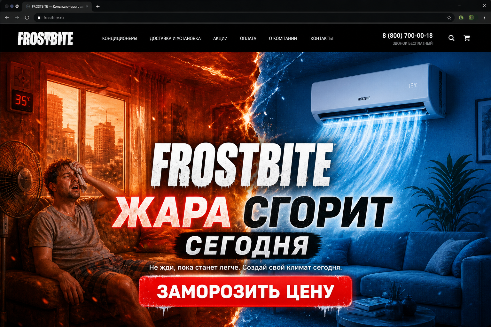
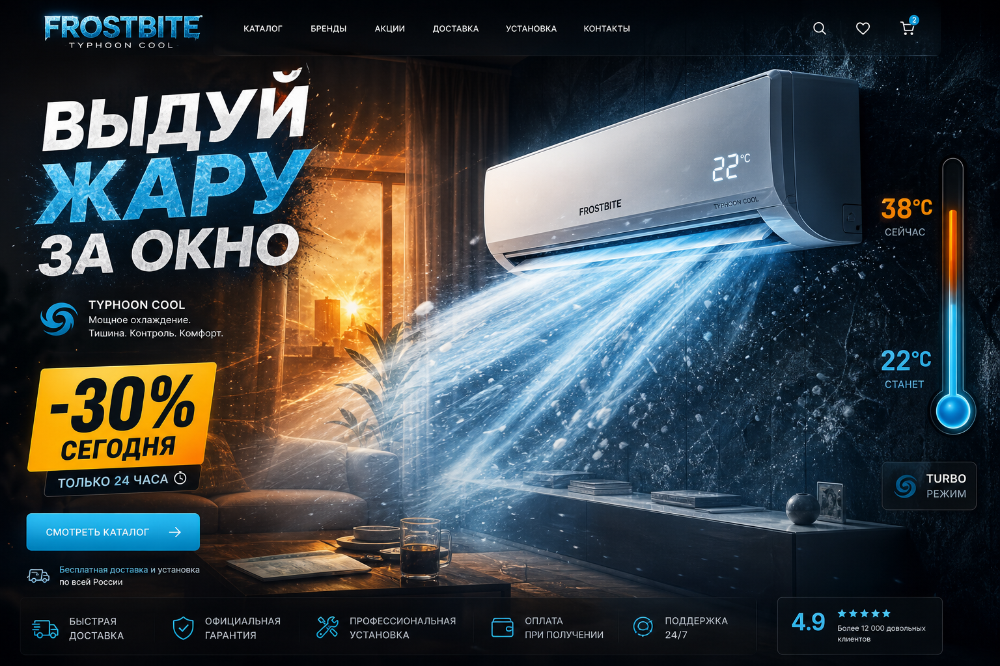
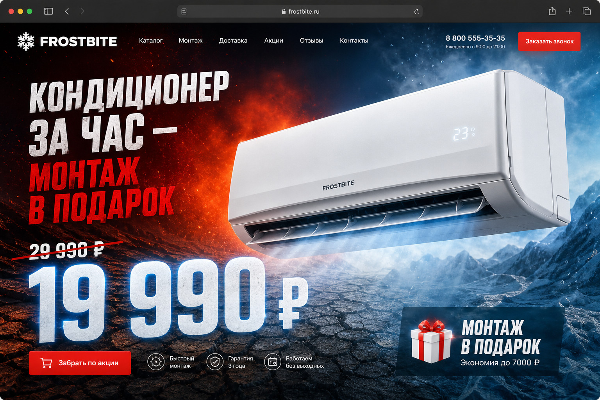
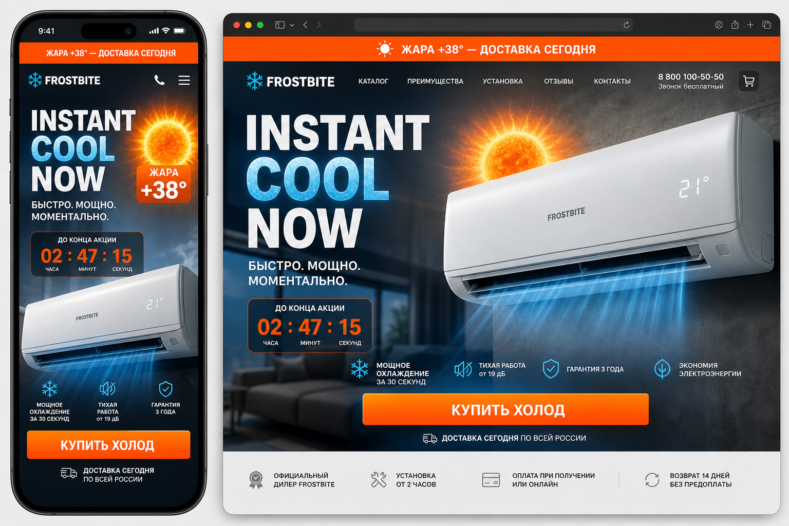

# FROSTBITE — бушующий сайт кондиционеров

Отдельная концепция агрессивного лендинга для продажи кондиционеров. Противоположность спокойному SILENCIO: здесь не «тишина», а **жара, срочность и мгновенный холод**.

## Идея

Летом кондиционер покупают не «посмотреть каталог», а **снять боль прямо сейчас**. Сайт должен ощущаться как:

- жара давит с экрана;
- холод — награда за действие;
- цена и монтаж — решающий аргумент за 3 секунды;
- CTA — не «узнать больше», а «заморозить / выдуть / купить сегодня».

Бренд-рабочее название: **FROSTBITE** (можно заменить на ваш).

## 4 направления дизайна

### 1. Heat vs Ice — «Жара сгорит сегодня»

**Суть:** экран пополам — слева плавящаяся жара, справа ледяное облегчение и кондиционер.

**Для кого:** сезонные распродажи, когда нужен максимальный контраст «до/после охлаждения».

**Реализуемо сейчас:** split-hero + CSS-градиенты + before/after или двойной фон; CTA «Заморозить цену».

---

### 2. Typhoon Cool — «Выдуй жару за окно»

**Суть:** кондиционер — источник мощного холодного потока. Термометр 38° → 22° как главный UI-элемент.

**Для кого:** акцент на мощности, скорости охлаждения, «чувствуешь холод сразу».

**Реализуемо сейчас:** анимированный счётчик температуры, SVG/Canvas-поток воздуха, один hero-продукт.

---

### 3. Price War — «19 990 ₽ + монтаж в подарок»

**Суть:** цена — главный герой. Крупная цифра, зачёркнутая старая цена, 3D-сплит в центре.

**Для кого:** агрессивный прайс-лидер, маркетплейс-логика, «дешевле некуда».

**Реализуемо сейчас:** типографика + один продукт + sticky-бар с ценой; без тяжёлого 3D (можно фото/Png).

---

### 4. Urgency — «Жара +38° — доставка сегодня»

**Суть:** срочность: таймер, погода, «купить холод» в один клик. Mobile-first.

**Для кого:** performance-маркeting, таргет в жару, быстрая конверсия с телефона.

**Реализуемо сейчас:** countdown, sticky CTA, короткая форма «адрес + модель + звонок».

## Общие правила «бушующего» стиля

| Принцип | Как это выглядит |
| --- | --- |
| Контраст | жара (янтарь/красный) ↔ холод (циан/лед) |
| Типографика | крупно, капс, цифры и цены — как удар |
| Hero | один продукт или один конфликт, не сетка из 12 SKU |
| CTA | глагол действия: «Заморозить», «Выдуть», «Купить холод» |
| Срочность | таймер, погода, «сегодня», «за час» |
| Доверие | монтаж, гарантия, отзывы — но ниже fold, не в hero |

## Что дальше

Выберите 1–2 направления — сверстаем в этой же папке (`ac-bush/`) как отдельный Vite-проект, по аналогии с SILENCIO.

Рекомендация по связке:

- **Heat vs Ice** — если нужен wow и сезонный бренд;
- **Urgency** — если нужны лиды из рекламы уже завтра.
